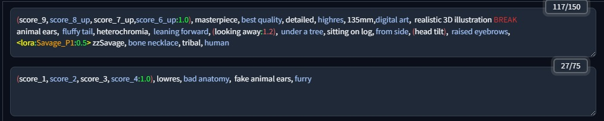

# SD WebUI Prompt Style

Extension for [AUTOMATIC1111/stable-diffusion-webui](https://github.com/AUTOMATIC1111/stable-diffusion-webui.git) to colorize your prompt. 




## Install

* Open the `Extensions` tab and navigate to `Install from URL`.
* Paste the repository URL into the `URL for extension's git repository` field:  
    ```
        https://github.com/bandifiu/sd-webui-prompt-style.git
    ```    

* Press the `Install` button.    
* Restart the WebUI using `Reload UI` button

## Customization

You can customize colors by changing CSS variables in your `user.css` at the root of WebUI intallation.

* If no `user.css` file present, create one
* The following variables are available.
* **Reload** the browser.

```CSS
.prompt-style {
    --keyword-color: var(--body-text-color);
    --keyword-odd-color: #a0c1f7;
    --colon-color: #56fd6c;         /* :            */
    --block-color: #ee6565;         /* ( )          */
    --block-brackets-color: #56fd6c;/* [ ]          */
    --block-angle-color: yellow;    /* < >          */
    --network-type-color: yellow;  
    --network-color: orange;        /* LoRa name    */
    --pipe-color: #e93232;          /* |            */
    --break-color: #e93232;         /* BREAK        */
    --delimiter-color: white;       /* ,            */
    --weight-down-color: #1bff39;   /* weight < 1   */
    --weight-up-color: #ee6565;     /* weight > 1   */
    --weight-color: #1bff39;        /* weight = 1   */
    --comment-color: #0a941d;       /* #comment     */
}
```
